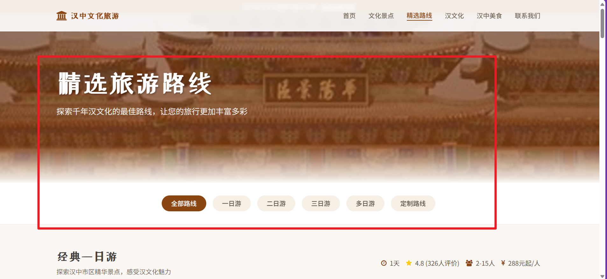
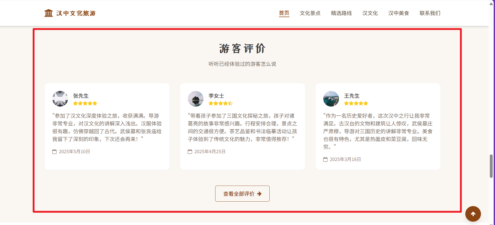
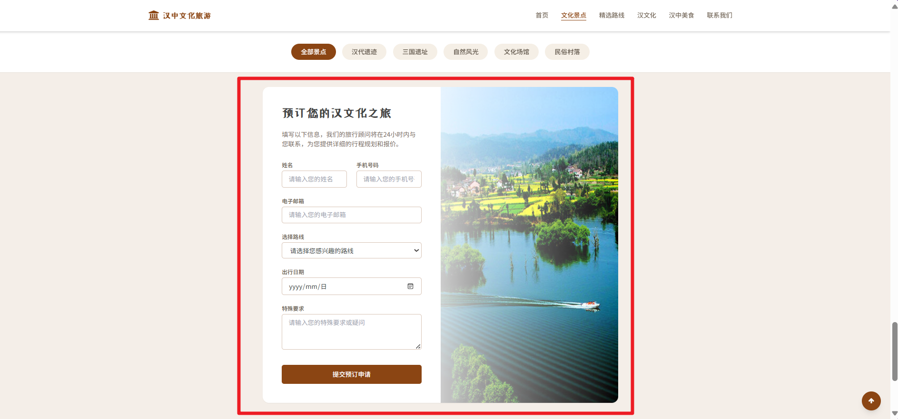

# 汉中文化旅游网站项目文档

## 一、项目概述

汉中文化旅游网站致力于全方位展示汉中丰富的旅游资源，包含文化景点、特色美食、汉文化内涵等多个方面。同时，提供旅游路线规划与预订服务，为游客打造一站式旅游信息平台，助力游客更好地了解和规划汉中之旅。

## 二、项目结构

### （一）网页文件

| 文件名称                 | 功能描述                                                     |
| ------------------------ | ------------------------------------------------------------ |
| contact_us.html          | 提供多种联系方式，承诺 24 小时（工作日）回复消息，强调信息安全和营业时间 |
| food_recommendation.html | 推荐汉中特色美食，介绍店铺信息和美食体验活动                 |
| han_culture.html         | 深入介绍汉中的三国文化、栈道文化等，提及相关历史遗迹和文化景点 |
| index.html               | 网站首页，展示汉中旅游整体信息，包含旅游路线、用户评价、文化体验活动等板块 |
| scenic_spots.html        | 介绍汉中文化景点，提供开放时间、门票价格等信息，支持预约参观和查看地图 |
| travel_routes.html       | 提供汉中旅游路线规划，包括不同类型的路线及行程亮点和安排     |
| test/test.html           | 用于测试功能或样式的页面                                     |

### （二）样式表文件夹 `css`

包含多个样式表文件，如 all.min.css、css2.css、css3.css 和 `font-awesome.min.css`，用于美化页面和实现响应式布局。其中 font-awesome.min.css 为 Font Awesome 图标库的样式表，为页面提供丰富的图标资源。

### （三）图片文件夹 `images`

按照不同主题分类存放项目所需图片，包括 `food/`（美食图片）、`han_culture/`（汉文化相关图片）、`index/`（首页图片）和 `scenic_spots/`（景点图片）。

### （四）JavaScript 文件夹 `js`

包含 `layui/` 文件夹，使用了 Layui 前端框架，以增强页面的交互性和功能。

### （五）详情文件夹 `detial/yejiao`

包含一些详细信息页面，如 yinsi.html（隐私政策页面）和 fuwu.html（服务条款页面）。

## 三、技术栈

### （一）前端框架

- **Tailwind CSS**：通过类名快速实现页面布局和设计，提高开发效率，使页面具有良好的响应式效果。
- **Layui**：可能用于实现部分交互功能，如表单验证、弹出层等。

### （二）图标库

- **Font Awesome**：提供丰富的图标资源，增强页面的视觉效果和用户体验。

### （三）响应式设计

通过 `meta` 标签设置响应式布局，确保网站在不同设备（如手机、平板、电脑）上都能完美显示。

## 四、主要功能模块

### （一）导航栏

提供网站主要导航链接，包括首页、文化景点、文化活动、汉文化、美食推荐和联系我们，方便用户快速访问不同页面。

### （二）旅游路线展示

在首页和旅游路线页面展示多种旅游路线，包括路线名称、行程天数、价格、参与人数、行程亮点等信息，支持查看详情和立即预订功能。

### （三）用户评价

展示游客的真实评价，包括用户头像、姓名、评分、评价内容和评价时间，帮助新用户了解旅游体验，增强用户信任。

### （四）文化体验活动

介绍汉中的文化体验活动，如书法临摹、茶艺品鉴、美食制作等，让游客深入感受汉文化的魅力。

### （五）预订功能

提供预订表单，用户可填写姓名、联系方式等信息，提交后旅行顾问将在 24 小时内与用户联系，提供详细行程规划和报价。

### 六）美食推荐

介绍汉中特色美食，提供美食体验活动，如传统市场探秘和厨艺体验课，满足游客的美食需求。

### （七）联系信息

在联系我们页面提供多种联系方式，包括电话、邮箱、线下地址等，并提供地图导航功能，方便用户与网站运营方取得联系。

## 五、部署和运行

### （一）环境要求

- 支持 HTML、CSS 和 JavaScript 的 Web 服务器，如 Apache 或 Nginx。
- 确保服务器已正确配置，能够正常访问项目文件。

### （二）部署步骤

1. 将项目文件上传至 Web 服务器的指定目录。
2. 配置服务器的虚拟主机或域名指向项目根目录。
3. 确保服务器的防火墙允许 HTTP 或 HTTPS 访问。

### （三）访问网站

在浏览器中输入网站的域名或 IP 地址，即可访问汉中文化旅游网站。

